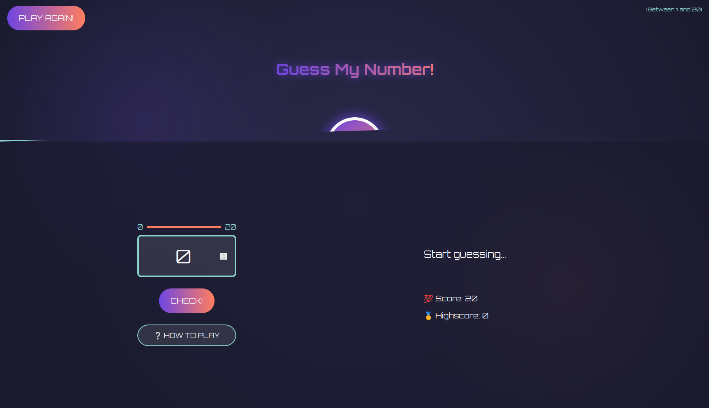

# 🎯 Guess The Number – Vanilla JS Game

A simple number guessing game built using HTML, CSS, and JavaScript. You guess a number between 1–20, and the app gives hints to guide you.

## 🚀 Live Demo
👉 [Try it now](https://megabytis.github.io/Guess-The-Number/)

## 🧪 Features
- Random number generator
- Score tracking system
- UI feedback for guesses (Too high/low, correct, etc.)
- Reset functionality

## ⚙️ Tech Stack
- HTML5
- CSS3
- JavaScript (DOM Manipulation)

## 📸 Screenshots

## 📌 Future Improvements
- Add difficulty levels
- Animate feedback transitions
- Sound effects

## 🙋‍♂️ Why I Built This
To practice DOM manipulation and build a fully interactive mini-game without using any frameworks.
